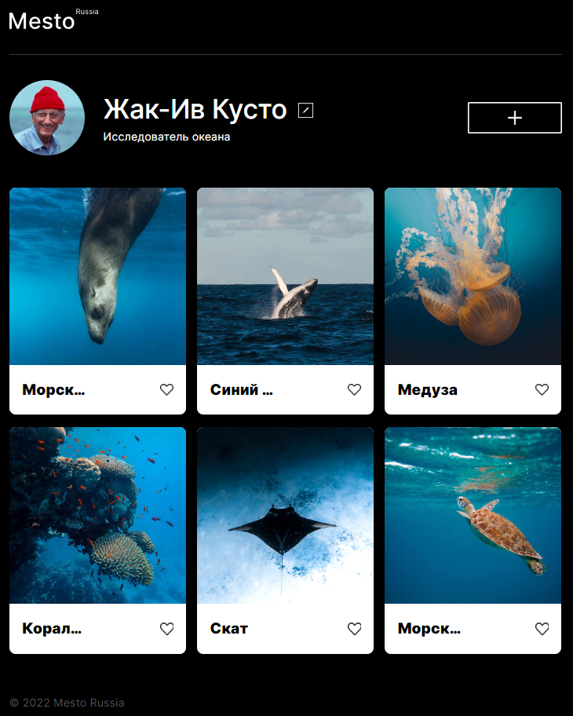

# «Mesto»

---

**Сервис «Mesto»** - это интерактивная страница, куда пользователь может добавлять фотографии, удалять их, а также ставить лайки.

---
Проект реализован с помощью **HTML**, **CSS** и **JavaScript**.
Код написан в соответствии со стандартами Яндекс Практикума в рамках третьего учебного проекта.

**[Ссылка на проект](https://yanika90.github.io/mesto/)**

---
**Использованы технологии:**

- Методология БЭМ:
  - классы единиц описаны по БЭМ,
  - файловая структура создана по БЭМ (Nested);
- Для создания сеток используется Flexbox и Grid;
- Созданы медиазапросы для адаптивности сайта на разных устройствах;
- Псевдоэлементы и псевдоклассы;
- Создана простая анимация для интерактивных элементов;
- Позиционирование элементов;
- Работа с макетом в Figma;
- JS для создания модальных окон.
- Рефакторинг кода на основе ООП концепции

Реализованы возможности: добавления и удаления карточек, отметить понравившуюся карточку, отредактировать профиль.

---

**Инструкция по установке:**
1. Клонировать репозиторий git@github.com:Yanika90/mesto.git
2. Установить зависимости _npm i_
3. Запустить проект локально _npm run dev_

---

**В планах последующая доработка:**

- _Подключить проект к серверу;_
- _Дать возможность пользователям добавлять и удалять карточки;_
- _Создать модальное окно удаления карточки;_
- _Создать счетчик лайков "like";_
- _Добавить возможность редактирования изображения профиля._
